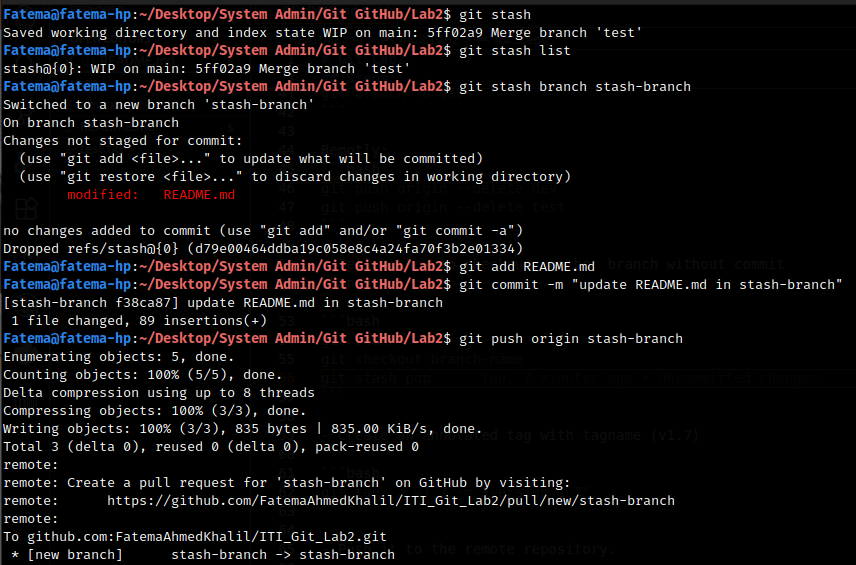
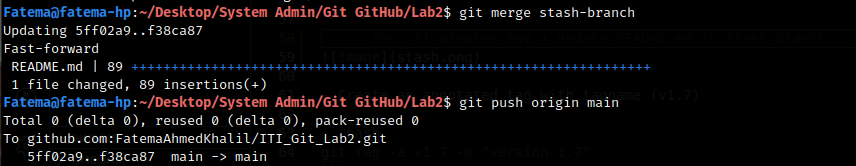

# Git Lab2

## Steps:

- Create two branches (dev & test) then create one file on each branch, and push this changes to the remote repo.

```bash
git checkout -b dev
touch dev.txt
echo "Dev Branch File" > dev.txt
git add .
git commit -m "add dev file"
git push origin dev

git checkout main

git checkout -b test
touch test.txt
echo "Test Branch File" > test.txt
git add .
git commit -m "add test file"
git push origin test
```

- Merge this changes on Main branch and then push it to your remote main branch.

```bash
git checkout main

git merge dev
git merge test

git push origin main
```

- Tell me how to remove them locally and remotely.

Locally:
```bash
git branch -d dev
git branch -d test
```

Remotly:
```bash
git push origin --delete dev
git push origin --delete test
```

- Tell me how to checkout another branch without commit
changes

```bash
git stash
git stash branch stash-branch
```





- Create an annotated tag with tagname (v1.7)

```bash
git tag -a v1.7 -m "version 1.7"
```

- Push it to the remote repository.

```bash
git push origin v1.7
```

- Tell me how to list tags.

```bash
git tag
```

- Tell me how to delete tag locally and remotely.

Locally:
```bash
git tag -d v1.7
```

Remotly:
```bash
git push origin --delete v1.7
```

